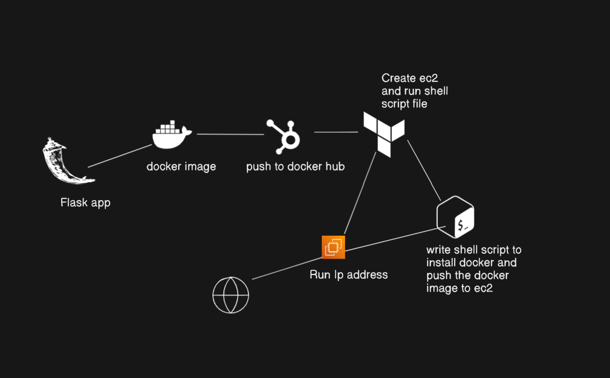
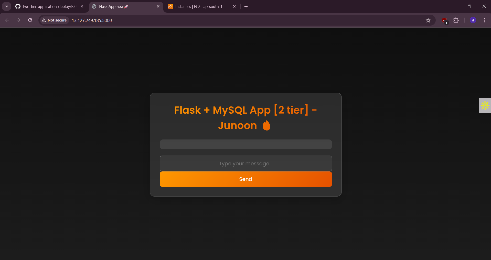
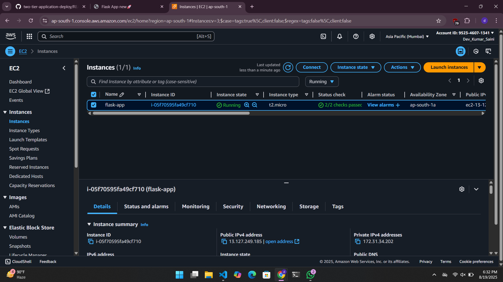
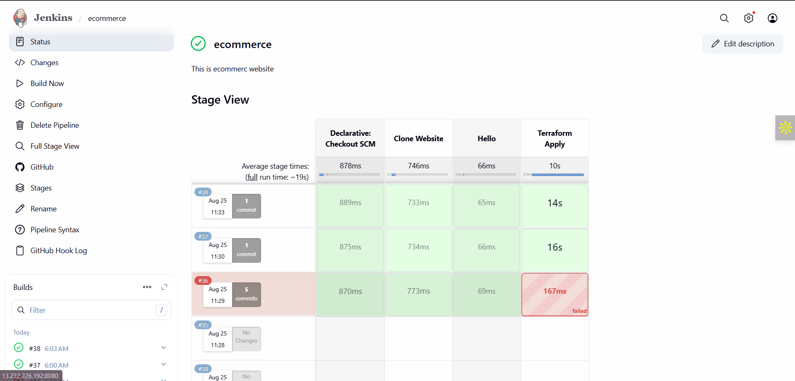

# Two-Tier Flask Application Deployment on AWS

🚀 **Project Overview**  
This project demonstrates a **Two-Tier Flask Application** deployed on **AWS EC2** with automated setup using **Docker**, **Docker Compose**, **Terraform**, **Shell Scripts**, and a **CI/CD pipeline with Jenkins**.  
The application is fully containerized, infrastructure is automated, and it is accessible via a public IP.

---

## 🌟 Key Highlights
- **Automated Deployment:** EC2 provisioning, Docker installation, and app startup all automated.  
- **Multi-Container Architecture:** Separate containers for **Flask frontend** and **MySQL backend**.  
- **Infrastructure as Code:** Terraform used to manage AWS resources.  
- **Secure State Management:** Terraform state stored in **S3** and locked using **DynamoDB** to prevent concurrent modifications.  
- **Continuous Integration & Deployment (CI/CD):** Jenkins pipeline automates cloning, infrastructure provisioning, and application deployment.  
- **Tech Stack:** Flask, MySQL, Docker, Docker Compose, Terraform, AWS EC2, Jenkins, Linux Shell.

---

## 🏗️ Project Architecture
  
*Frontend and backend running on a single EC2 instance using Docker containers.*

---

## 📸 Application Screenshot
  
  
*Live Flask app running on AWS EC2.*

---

## 💻 How It Works
1. **Terraform** provisions an AWS EC2 instance, security group, and manages infrastructure using **S3 + DynamoDB for secure state management**.  
   > ⚠️ **Note:** To enable secure state management, first manually create an **S3 bucket** and a **DynamoDB table** before running Terraform.  
2. **Shell Script** installs Docker, Docker Compose, and creates network + volume for persistent data.  
3. **Docker Compose** launches the Flask app and MySQL database containers.  
4. **Jenkins CI/CD Pipeline**:
   - Automatically triggers on GitHub push (webhook).  
   - Clones repository.  
   - Runs Terraform to create infrastructure.  
   - Deploys Docker containers.  
   - Uses **Shared Library** for reusable pipeline steps.  
5. **Public IP** from Terraform is used to access the application.

---

## 🎯 Outcome
- Fully automated **Two-Tier Application Deployment** on AWS.  
- Demonstrates ability to combine **Cloud, DevOps, and CI/CD practices**.  
- Implements **secure Terraform state management** to prevent conflicts during concurrent runs.  

---

## 📂 Tech Stack
| Frontend | Backend | DevOps / Cloud |
|----------|---------|----------------|
| Flask    | MySQL   | Docker, Docker Compose, Terraform (S3 + DynamoDB), AWS EC2, Jenkins, Shell Scripts |

---

## 🔄 CI/CD Pipeline with Jenkins
The pipeline is implemented using **Jenkins + Shared Library** for reusability.

**Pipeline Stages:**
1. **Clone Website Code** → Fetch app repo from GitHub.  
2. **Terraform Apply** → Provision EC2, networking, and manage state securely.  
3. **Deploy Containers** → Start Flask & MySQL with Docker Compose.  
4. **Notification (optional)** → Send success/failure status.

---

## 📸 Jenkins Screenshot
  

---

## 🔄 Shared Library GitHub Link
[https://github.com/DEVKUMARSAINI545/jenkins-shared-libraries.git](https://github.com/DEVKUMARSAINI545/jenkins-shared-libraries.git)

---

## 📝 Jenkinsfile Example
```groovy
@Library("Shared") _
pipeline {
    agent any

    stages {
        stage('Clone Website') {
            steps {
                script {
                    clone('https://github.com/DEVKUMARSAINI545/two-tier-application-deploy.git', "main")
                }
            }
        }

        stage('Terraform Apply') {
            steps {
                script {
                    terraform()
                }
            }
        }

        stage('Hello') {
            steps {
                echo 'Hello! Two-Tier Application CI/CD pipeline executed successfully.'
            }
        }
    }
}
